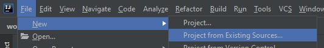
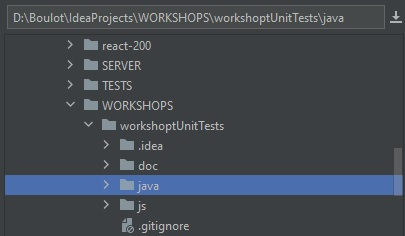

# Workshop Unit Tests

## Installation
First, clone this repo.

### Java import
Create new project from the **java** folder : File -> New -> Project from existing source

 

You can test installation is done by :
- running the tests :
    - `mvn clean test`
    - or right click on java/src/test/java folder -> Run 'All tests'
- launching server and make a call (via Postman or equivalent) to http://localhost:8080/ping 

### JS import
Create new project from the **js** folder : File -> New -> Project from existing source

You can test installation is done by :
- opening index.html file
- and by running the tests : `npm run test`

## Exercice
