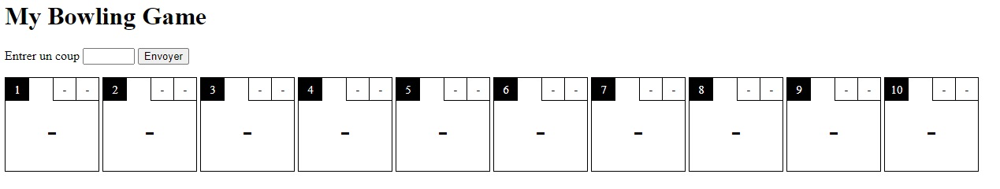

# Workshop Unit Tests
The purpose of this workshop is to explore how to do unit tests and test driven development efficiently.

## Installation
First, clone this repo.

### Java import
First possibility open the whole project and import the java folder as module (F4 -> Modules -> "+" button -> Import Module -> choose the pom.xml file)

 
 


You can test installation is done by :
- running the tests :
    - `mvn clean test`
    - or right click on java/src/test/java folder -> Run 'All tests'
- launching server and make a call (via Postman or equivalent) to http://localhost:8080/ping 

### JS import
Either open the whole project or select the "js" folder with File -> New -> Project from existing source


You can test installation is done by :
- opening index.html file
- and by running the tests : `npm run test`



## Exercice
You will implement an algorithm to calculate the score of a bowling game. 
To simplify the exercice, we concidere there is only one person playing.

### Entrypoints
#### Java
You've got 2 API endpoints:
- POST /game/shoot Add a shoot to the current game.
```json
{
    "shotValue": number
}
```
Returns the state of the current game (text representation).
```text
[- | -]   [- | -]   [- | -]   [- | -]   [- | -]   [- | -]   [- | -]   [- | -]   [- | -]   [- | -]   
-         -         -         -         -         -         -         -         -         -         
```

- POST /clear Clear the current game (remove all shots).

#### JS
In Javascript, you can add a shoot to the current game by typing a score into the input field add pressing the submit button (or the Enter key).
The method update automatically the score table.

### Bowling rules
A bowling game is split into 10 frames of 2 tosses each, except for the tenth which could have a third under certain condition. 
The purpose of each frame is to bring down all 10 pins in 1 or 2 tosses. The down pins are moved aside (they're not lifted up) so each frame has a maximum total of 10 pins brought down (except for the tenth frame).

- If less than 10 pins are down after the 2 tosses, it's a hole. The score of the frame is the sum of the number of pins hitten on each toss.
- If the player succeed to hit all 10 pins in 2 tosses, it's a spare. A spare worth 10 points + the number of pins hitten on the next toss. 
If you do a spare on the first frame and then hit 7 pins on the first toss of the second frame, the score of your first frame is 17. 
(the 7 pins are also counted in the calculation of the second frame score)
- If the player succeed to hit all 10 pins in the first toss of the frame, it's a strike. A strike worth 10 + the number of pins hitten on the next 2 tosses.
If you do a strike on the first frame, then a strike on the second frame and then hit 7 pins on the first toss of the third frame, the score of your first frame is 27.
- If the player succeed to hit all 10 pins in the second toss of the frame (0 pin hitten on the first), it's a spare - not a strike - and should be resolve as mentioned above.

The tenth frame is particular. If the player do a strike on the first toss of the tenth frame, the player could have 2 more tosses (3 in total).
If the player do a spare on the second toss of the tenth frame, the player could have 1 more toss (3 in total).

**Example**<br/>
A player does a strike on the first frame, a spare on the second (7|/) and a hole on third (9|0), the final score should be **48** :
- The score of the first frame is 20 : 10 + 7 + 3
- The score of the second frame is 19 : 10 + 9
- The score of the third frame is 9 : 9 + 0

### Extras
If you finished early, you can fix the score display to match the real game display:
- For a hole, the number of pins hitten is written in each upper squares
- For a spare, the first upper square is the number of pins hitten, the second is a "/" characater
- For a strike, the first upper square is a "X" characeter, the second is empty

If you want to spice the dojo, you can add some [Object Calisthenics](https://williamdurand.fr/2013/06/03/object-calisthenics/) to the exercice.

- [ ] Only One Level Of Indentation Per Method
- [ ] Don’t Use The ELSE Keyword
- [ ] Wrap All Primitives And Strings
- [ ] First Class Collections - *Any class that contains a collection should contain no other member variables*
- [ ] One Dot Per Line
- [ ] Don’t Abbreviate - *the name of each class / method should be perfectly clear*
- [ ] Keep All Entities Small - *No class over 50 lines and no package over 10 files*
- [ ] No Classes With More Than Two Instance Variables - *No more than 2 attributes*
- [ ] No Getters/Setters/Properties

